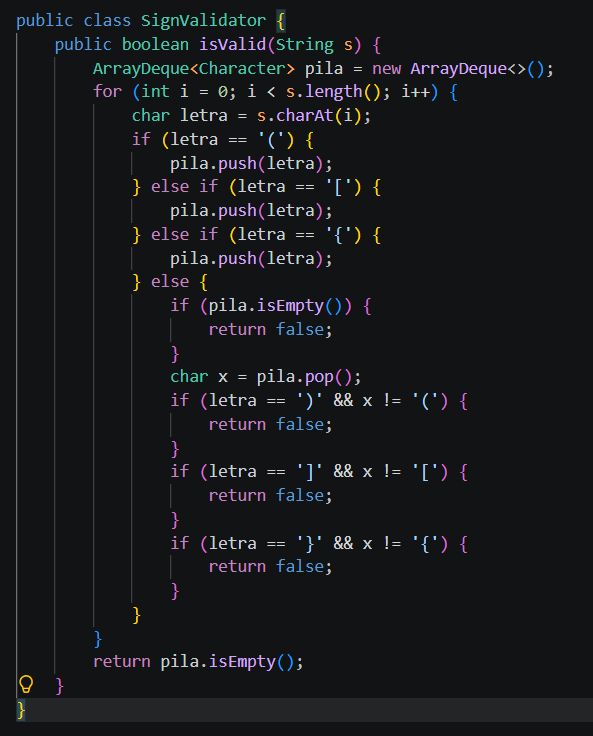
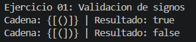
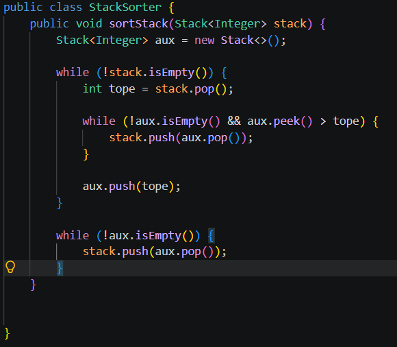
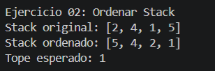
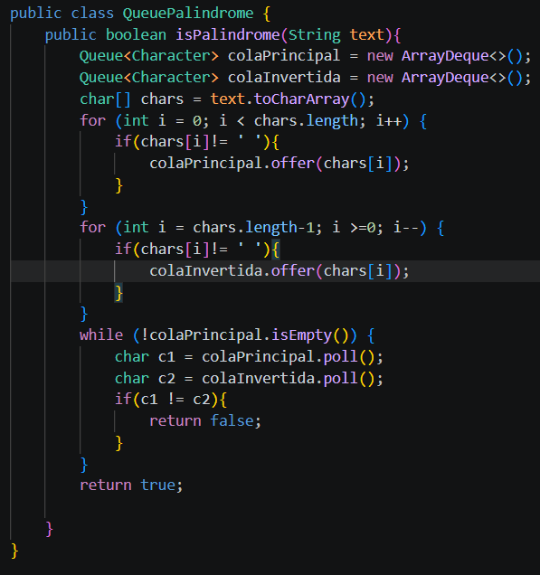
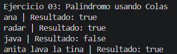

# Practica 03 - Ejercicios de logica con estructuras lineales: pilas y colas
## Datos del Estudiante
- **Nombre:** [Micaella Bustos, Axel Gonzalez y Santiago Satama]
- **Curso:** [Estructura de Datos Gpo #1]
- **Fecha:** [12/06/2026]

## Descripcion General del Proyecto

Este proyecto implementa tres ejercicios de logica utilizando estructuras lineales en Java (pilas y colas). El codigo esta organizado en paquetes según la estructura requerida por la practica.

---

## Ejercicio 01: Validacion de Signos

### Explicacion
En este ejercicio se creó una clase llamada SignValidator usando una pila con ArrayDeque. Su función es revisar si una cadena tiene los signos () [] {} correctamente abiertos y cerrados. Si todos los signos están en el orden correcto el método devuelve true y si existe algún error devuelve false.
### Codigo

### Salida de Consola

### Observación:
Se puede observar en consola que se validaron correctamente los signos de apertura y cierre haciendo uso de una pila

## Ejercicio 02: Ordenar Stack 

### Explicacion

Se crea un stack auxiliar aux sacando cada elemento del stack original y se guarda en "tope". Si el tope de aux es mayor que "tope" se lo regresa al stack original para recolocarlo despues. Cuando ya no hay nada mayor en aux se mete "tope" en aux quedando aux ordenado de menor abajo a mayor arriba. Al final se invierte aux de regreso al stack original lo que invierte el orden dejando el menor en el tope como se ve en la salida [5, 4, 2, 1] con tope 1.

### Codigo

### Salida de Consola

### Observación:
Se puede observar en consola que el satck fue ordenado de mayor a menor usando una pila auxiliar

## Ejercicio 03: Palindromo usando colas

### Explicacion
En este ejercicio se creó una clase llamada QueuePalindrome usando dos colas con ArrayDeque. Su función es convertir el texto en un arreglo de caracteres. Luego se va a encargar de llenar la colaPrincipal de izquierda a derecha y colaInvertida de derecha a izquierda, tambien le colocamos un if para ignorar espacios en caso de tener una frase. Para finalizar, compara caracter a caracter usando el poll() en ambas colas no se compara el string con la palabra invertida como en la anterior practica. Al finalizar si todos los caracteres coinciden, devuleve true caso contrario devuelve false.

### Codigo

### Salida de Consola

### Observación:
Se puede observar en consola que se verifico correctamente el palindromo usando una cola, gnorando espacios en caso de tener frases.

## Conslusiones
### Conclusión 1:
Las pilas permiten validar los signos de apertura y cierre recorriendo la cadena una sola vez. Cada signo de apertura se guarda en la pila y cuando aparece un signo de cierre se compara con el último guardado. Si al final la pila queda vacía la cadena es válida.
### Conclusión 2:
Ordenar un stack sin usar arreglos ni listas es posible usando solo un stack auxiliar, sacando cada elemento y recolocando los que no corresponden hasta que aux quede ordenado y al devolverlo de regreso el menor queda en el tope.

### Conclusión 3:
Determinar si una palabra es palindromo usando colas llenando una cola en orden normal y otra en orden inverso y comparando caracter por caracter sin necesidad de comparar directamente el string original con su version invertida.